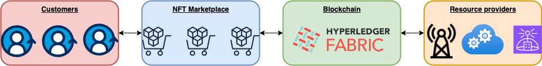

# **FraMark** - A Blockchain **Mar**ketplace for a 5G Network Management using **Fra**ctional NFTs

FraMark is an innovative blockchain-based marketplace framework for 5G network management, leveraging Hyperledger Fabric and fractional NFTs. This approach introduces a novel system for issuing and managing fractionalized digital assets representing 5G resources, aimed at enhancing network efficiency. Central to this framework is the goal of achieving low latency and high throughput in transaction processing, critical for the demands of modern 5G networks. 

A paper that will be published outlines prospective benefits, challenges, and future directions, including the potential integration of tokenomics, to offer insights into the future of 5G network management.

# Authors

George Michoulis, Kyros Tsourdinis, George Niotis, George Andronikidis, Konstantinos Kyranou, Zisis Batzos

Sidroco Holdings Ltd

Research & Development Department, Karyatis 8, Leoforos Kyriakou Matsi 23, CY-1082, Nicosia, Cyprus

{g.michoulis, ktsourdinis, geoniotis, gandronikidis, kkyranou, zbatzos}@sidroco.com
